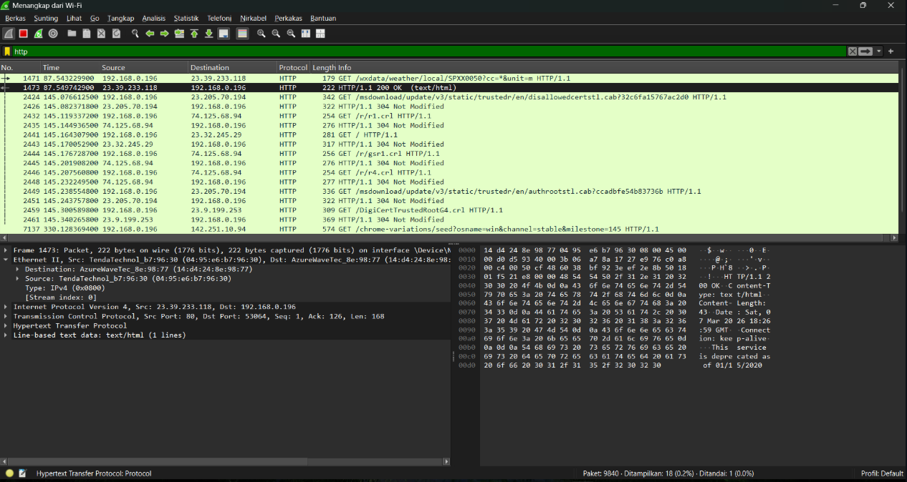

## Laporan praktikum modul 2 jarkom 

# Tujuan Praktikum 

1.Memahami antarmuka (interface) dan fitur-fitur dasar pada aplikasi Wireshark.

2.Mampu melakukan capture (tangkapan) paket data pada jaringan yang sedang aktif.

3.Mampu menggunakan fitur filter tampilan untuk mencari dan menganalisis protokol jaringan tertentu, khususnya HTTP.

4.Memahami konsep enkapsulasi data jaringan dengan menganalisis lapisan protokol (HTTP, TCP, IPv4, Ethernet II).

## Syarat serta alat yang diperlukan untuk pengaplikasian 

1.Laptop

2.Aplikasi Wireshark yang sudah terinstal

3.Koneksi Jaringan (Wi-Fi atau LAN/Ethernet)

4.Browser web (untuk menghasilkan traffic HTTP)

## Langkah Langkah Pengimpelentasian 

A. Inisiasi Penangkapan Paket (Packet Capture)

1.Jalankan perangkat lunak Wireshark pada sistem.

2.Pada antarmuka utama, identifikasi dan pilih antarmuka jaringan (network interface) yang aktif dan terhubung ke internet (misalnya, Wi-Fi atau Ethernet).

3.Klik ganda pada interface tersebut, atau tekan ikon sirip hiu biru (Start capturing packets) di sudut kiri atas untuk memulai perekaman lalu lintas jaringan

4.Buka web browser dan akses sembarang situs web untuk menstimulasi aktivitas lalu lintas data.

B. Implementasi Display Filter (Penyaringan Tampilan)

1.Kembali ke antarmuka Wireshark, arahkan kursor ke bilah display filter yang terletak di bagian atas jendela aplikasi.

2.Masukkan kata kunci http (huruf kecil) ke dalam kolom penyaringan tersebut.

3.Tekan Enter atau klik ikon panah biru (Apply) di sisi kanan kolom untuk mengeksekusi filter.

4.Observasi panel Packet List; saat ini daftar hanya akan memunculkan paket data yang beroperasi secara spesifik dengan protokol HTTP.

C. Analisis Enkapsulasi Data Protokol HTTP

1.Pilih dan klik salah satu baris paket HTTP pada panel Packet List.

2.Arahkan fokus ke panel Packet Details di bagian tengah layar.

3.Lakukan ekspansi (klik ikon panah >) pada setiap lapisan protokol untuk menelaah hierarki enkapsulasi secara terperinci:

Hypertext Transfer Protocol (HTTP): Menampilkan rincian pesan tingkat aplikasi dari situs yang sedang diakses.

Transmission Control Protocol (TCP): Mengindikasikan bahwa pesan HTTP dienkapsulasi ke dalam segmen TCP.

Internet Protocol Version 4 (IPv4): Menunjukkan bahwa segmen TCP dibungkus kembali menjadi datagram IPv4.

Ethernet II: Menandakan bahwa datagram IPv4 dibingkai ke dalam frame Ethernet untuk transmisi fisik (Wi-Fi/LAN).

4.Melalui observasi berjenjang dari pesan, segmen, datagram, hingga frame ini, mekanisme pembungkusan dan pengiriman pesan HTTP di dalam jaringan dapat dipahami secara komprehensif.

D. Terminasi Penangkapan Paket

1.Setelah analisis selesai dilakukan, hentikan proses perekaman jaringan dengan mengeklik ikon kotak merah (Stop capturing packets) pada toolbar atas.

## Lampiran 

# Hasil Percobaan 

Hasil Percobaan : 
