## Laporan Modul 3 jarkom HTTP

# pengantar 
Praktikum kali ini berfokus pada observasi komunikasi protokol HTTP yang berlangsung saat browser mengakses suatu halaman web. Analisis dilakukan dengan memanfaatkan perangkat lunak Wireshark guna melakukan sniffing atau menangkap paket data jaringan yang lalu lalang selama proses transmisi tersebut. Berdasarkan hasil capture, evaluasi dititikberatkan pada layer Hypertext Transfer Protocol (HTTP) guna memeriksa detail request, response, beserta muatan data yang dipertukarkan antara sisi client dan server. Tujuannya agar praktikan mampu menguasai konsep dasar alur komunikasi HTTP di dalam suatu jaringan.

# Basic HTTP GET/ response interaction 	Basic HTTP GET/response interaction
Sesi ini mengamati interaksi dasar HTTP antara client dan server ketika melakukan pemuatan web. Menggunakan Wireshark, pemantauan difokuskan pada pertukaran paket data saat mengakses halaman web statis yang bebas dari embedded object. Tahap awal melibatkan eksekusi aplikasi Wireshark, penentuan antarmuka jaringan (misalnya Wi-Fi), lalu memulai proses capture.
Setelah diinisiasi, semua paket jaringan yang aktif di perangkat akan terekam oleh aplikasi. Langkah berikutnya adalah membuka URL yang telah ditentukan pada modul: http://gaia.cs.umass.edu/wireshark-labs/HTTP-wireshark-file1.html melalui browser. Saat diakses, browser meluncurkan HTTP request menuju server untuk mengambil file HTML , yang kemudian dibalas oleh server dengan HTTP response berisi halaman terkait.
Untuk mempermudah analisis, diterapkan display filter http pada Wireshark agar hanya paket berprotokol HTTP yang muncul. Dari hasil penangkapan paket, terdeteksi bahwa client mengeksekusi request GET /wireshark-labs/HTTP-wireshark-file1.html HTTP/1.1. Hal ini mengindikasikan pemanggilan file HTTP-wireshark-file1.html dari server gaia.cs.umass.edu via metode GET. Metode ini bertugas meminta suatu resource atau halaman web dari server. Selain itu, terlihat pula informasi IP pengirim (client) yakni 192.168.1.8 dan IP tujuan (server) 128.119.245.12, di mana keduanya berkomunikasi melalui protokol HTTP versi 1.1. Server akan merespons permintaan tersebut dengan menyuplai halaman web yang dituju.

## lampiran
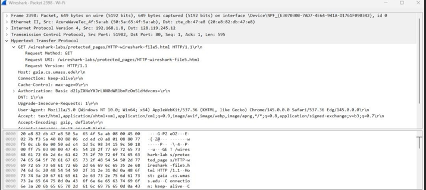

Selanjutnya browser digunakan untuk membuka halaman yang telah disediakan pada modul praktikum, yaitu:
http://gaia.cs.umass.edu/wireshark-labs/HTTP-wireshark-file1.html
Ketika halaman tersebut dibuka, browser akan mengirimkan request HTTP kepada server untuk mengambil file HTML tersebut. Server kemudian memberikan response berupa halaman web yang diminta oleh client.

## lampiran 
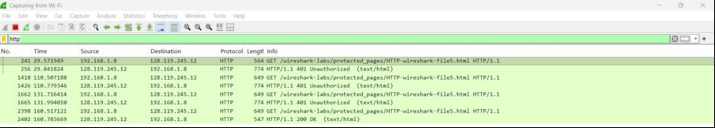

Setelah halaman berhasil dibuka, kembali ke aplikasi Wireshark kemudian lakukan filter pada kolom Display Filter dengan mengetikkan: http
Filter ini digunakan agar Wireshark hanya menampilkan paket yang menggunakan protokol HTTP sehingga paket yang dianalisis lebih mudah ditemukan.

## lampiran 
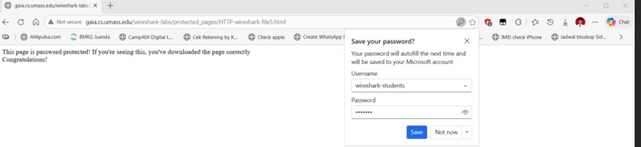

Berdasarkan hasil capture pada Wireshark terlihat bahwa client mengirimkan permintaan HTTP kepada server untuk mengambil file halaman web. Pada bagian Hypertext Transfer Protocol terlihat request:
GET /wireshark-labs/HTTP-wireshark-file1.html HTTP/1.1
Hal ini menunjukkan bahwa client meminta file HTTP-wireshark-file1.html dari server gaia.cs.umass.edu menggunakan metode GET. Metode GET digunakan oleh client untuk meminta resource atau halaman web dari server.
Dari paket tersebut juga terlihat bahwa komunikasi menggunakan protokol HTTP/1.1 dengan alamat IP client 192.168.1.8 dan alamat IP server 128.119.245.12. Permintaan ini kemudian akan direspon oleh server dengan mengirimkan halaman web yang diminta oleh client. 

## retrieving long document 

Tahap ini bertujuan untuk meneliti penanganan HTTP saat mengunduh dokumen HTML berskala besar atau memuat teks panjang. Pengamatan dieksekusi dengan membuka tautan http://gaia.cs.umass.edu/wireshark-labs/HTTP-wireshark-file3.html di browser selagi Wireshark menjalankan capture. Pasca halaman termuat, filter http kembali diaplikasikan. Berdasarkan tangkapan Wireshark, tercatat request berupa GET /wireshark-labs/HTTP-wireshark-file3.html HTTP/1.1. Ini membuktikan client meminta file berukuran panjang tersebut dari server gaia.cs.umass.edu dengan metode GET. Identitas IP yang terlibat masih konstan, yaitu 192.168.1.8 untuk client dan 128.119.245.12 untuk server. Sebagai balasan, server mengeluarkan status HTTP/1.1 200 OK (text/html), yang berarti permintaan berhasil diproses dan file HTML dikirim ke client. Hasil akhir pada browser menampilkan teks "The Bill of Rights". Ini mengonfirmasi bahwa skema protokol HTTP sukses menarik resource utuh dari server, di mana metode GET dari client dibalas dengan data web yang sesuai.http://gaia.cs.umass.edu/wireshark-labs/HTTP-wireshark-file3.html

## lampiran
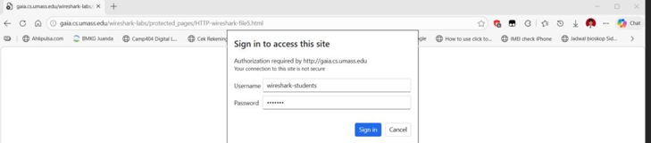
Setelah halaman tersebut dibuka, Wireshark akan menangkap paket komunikasi yang terjadi antara client dan server. Kemudian dilakukan filter dengan mengetik http pada kolom display filter agar hanya paket HTTP yang ditampilkan.

## lampiran 
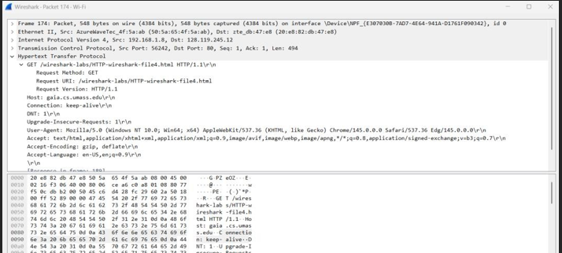

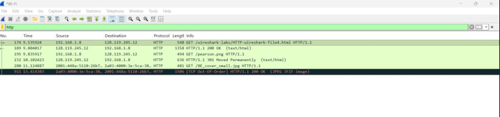

Berdasarkan hasil capture pada Wireshark terlihat paket request:
GET /wireshark-labs/HTTP-wireshark-file3.html HTTP/1.1
Hal ini menunjukkan bahwa client meminta file HTTP-wireshark-file3.html dari server gaia.cs.umass.edu menggunakan metode GET. Dari paket tersebut juga terlihat bahwa alamat IP client adalah 192.168.1.8 dan alamat IP server adalah 128.119.245.12.

Server kemudian memberikan respon berupa HTTP/1.1 200 OK (text/html) yang menandakan bahwa permintaan berhasil diproses dan server mengirimkan dokumen HTML kepada client. Dokumen yang diterima berisi halaman The Bill of Rights yang terlihat pada browser.
Hal ini menunjukkan bahwa protokol HTTP digunakan untuk mengambil dokumen dari server, dimana client mengirimkan request menggunakan metode GET dan server memberikan respon berupa data halaman web yang diminta.

## HTML Documents dengan Embedded Objects

Skenario selanjutnya berfokus pada halaman HTML yang menyertakan objek tambahan di dalamnya (embedded objects), seperti gambar. Langkah praktikum mengharuskan akses ke tautan http://gaia.cs.umass.edu/wireshark-labs/HTTP-wireshark-file4.html via browser. Setelah memfilter paket menjadi http saja , Wireshark merekam adanya serangkaian request GET. Request perdana, GET /wireshark-labs/HTTP-wireshark-file4.html HTTP/1.1, bertujuan mengunduh kerangka HTML utama dari server gaia.cs.umass.edu. Setelah HTML tersebut terpindai oleh browser, terdeteksi request susulan guna mengunduh elemen gambar yang tertanam di halaman tersebut, yaitu pearson.png dan gambar 8E_cover_small.jpg. Server lantas membalas setiap permintaan objek tersebut dengan kode HTTP/1.1 200 OK, menandakan seluruh embedded object berhasil dikirimkan ke client. Dapat ditarik kesimpulan bahwa pemuatan halaman web yang mengandung embedded objects akan memicu browser untuk melepaskan banyak GET requests guna merangkai halaman beserta isinya secara menyeluruh

## lampiran
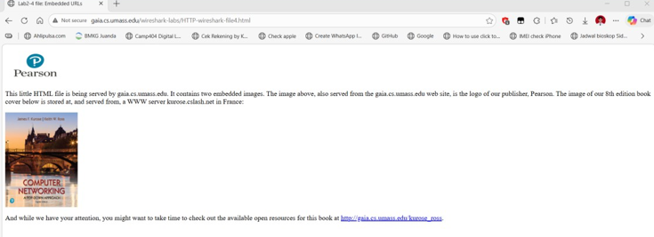

Setelah halaman tersebut dibuka, Wireshark akan menangkap paket komunikasi yang terjadi antara client dan server. Kemudian dilakukan filter dengan mengetik http pada kolom display filter agar hanya paket HTTP yang ditampilkan.

## lampiran 
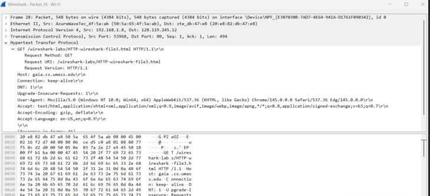

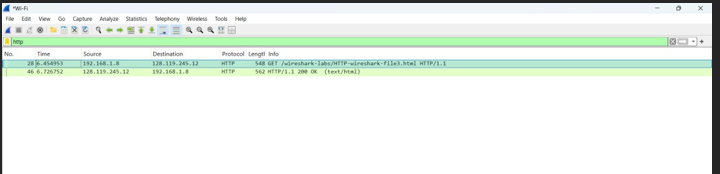

Berdasarkan hasil capture pada Wireshark terlihat beberapa paket request GET. Request pertama adalah:
GET /wireshark-labs/HTTP-wireshark-file4.html HTTP/1.1
Hal ini menunjukkan bahwa client meminta file HTML utama dari server gaia.cs.umass.edu. Setelah file HTML diterima, browser kemudian mengirimkan request tambahan untuk mengambil objek yang terdapat pada halaman tersebut, seperti gambar pearson.png dan gambar 8E_cover_small.jpg.
Server kemudian memberikan respon berupa HTTP/1.1 200 OK yang menandakan bahwa permintaan berhasil diproses dan objek yang diminta berhasil dikirimkan kepada client.
Dari hasil tersebut dapat disimpulkan bahwa ketika sebuah halaman HTML memiliki embedded objects, maka browser akan mengirimkan beberapa request GET untuk mengambil setiap objek yang terdapat pada halaman tersebut.

## HTTP Authentication

Sesi terakhir membahas alur autentikasi HTTP pada situs yang diproteksi oleh kredensial (username dan password). Pengujian dilakukan dengan mengakses URL http://gaia.cs.umass.edu/wireshark-labs/protected_pages/HTTP-wireshark-file5.html. Browser otomatis memunculkan pop-up form login otorisasi yang menuntut input username serta password. Halaman baru akan bisa dimuat seutuhnya setelah user memasukkan kombinasi sandi yang valid 

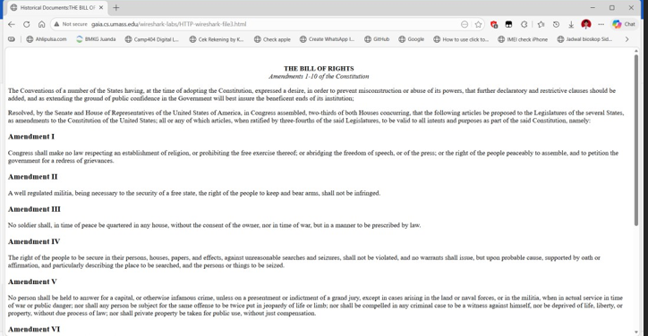

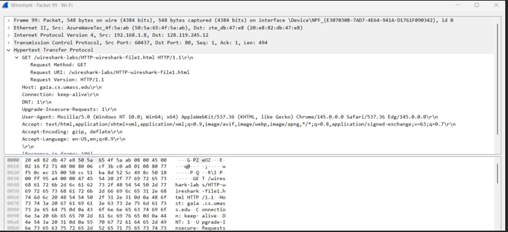

Ketika halaman tersebut dibuka, browser akan menampilkan form login yang meminta username dan password untuk mengakses halaman tersebut. Setelah memasukkan username dan password yang benar, halaman web kemudian berhasil ditampilkan.

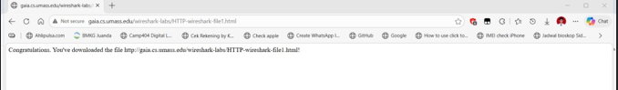

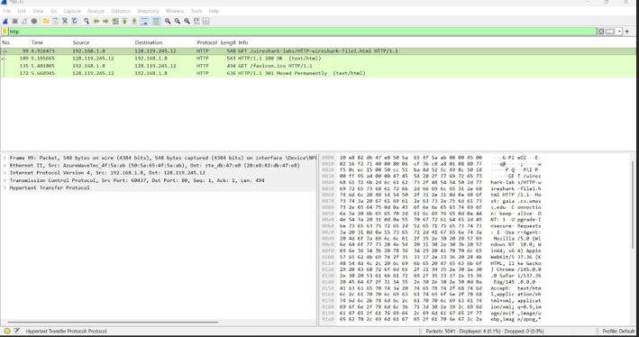

Selama proses tersebut, Wireshark menangkap komunikasi antara client dan server. Setelah dilakukan filter dengan mengetik http pada kolom display filter, terlihat beberapa paket HTTP yang menunjukkan proses autentikasi.
Berdasarkan hasil capture terlihat request:
Dari sisi Wireshark, jejak pertukaran datanya direkam untuk dianalisis. Awalnya, terlihat client mencoba menembus lewat perintah GET /wireshark-labs/protected_pages/HTTP-wireshark-file5.html HTTP/1.1. Karena rute tersebut terproteksi, server menolak akses dengan status HTTP/1.1 401 Unauthorized. Pesan error ini merupakan indikator bahwa server mewajibkan proses autentikasi. Setelah pengguna menyuplai kredensial di browser, sistem kembali melontarkan GET request, namun kali ini disisipkan header Authorization: Basic yang membawa informasi otorisasi. Berhubung login berhasil, server lalu merespon dengan HTTP/1.1 200 OK, memberi lampu hijau bagi client untuk menelusuri laman yang dikunci tersebut.

## SEKIAN TERIMA KASIHHH 

